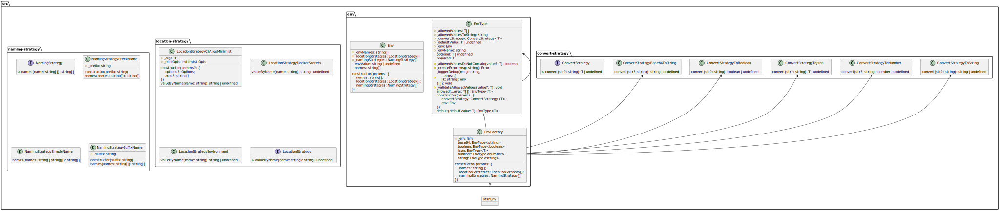

[](https://beecode.semaphoreci.com/projects/msh-env)
[](https://codecov.io/gh/beecode-rs/msh-env)
[](https://github.com/beecode-rs/msh-env/blob/main/LICENSE)  
[](https://nodei.co/npm/@beecode/msh-env)

# msh-env

Micro-service helper for Node.js environment variable validation and typing.

This library provides type-safe environment variable access with validation, default values, and flexible configuration strategies.

## Table of Contents

- [Install](#install)
- [Usage](#usage)
  - [Basic Example](#basic-example)
  - [Terminal Operations](#terminal-operations)
- [API](#api)
  - [Type Converters](#type-converters)
  - [MshNodeEnv Options](#mshnodeenv-options)
- [Strategies](#strategies)
  - [Location Strategy](#location-strategy)
  - [Naming Strategy](#naming-strategy)
  - [Logger Strategy](#logger-strategy)
- [Architecture](#architecture)
- [License](#license)

## Install

```bash
npm i @beecode/msh-env
```

## Usage

### Basic Example

```typescript
import { MshNodeEnv } from '@beecode/msh-env'
import { cacheUtil } from '@beecode/msh-util/dist/lib/cache-util'

const env = MshNodeEnv()

export const config = cacheUtil.singleton(() => Object.freeze({
  // Required - throws if not defined
  apiKey: env('API_KEY').string.required,
  port: env('PORT').number.required,

  // Optional - returns undefined if not defined
  debugMode: env('DEBUG_MODE').boolean.optional,

  // Default - returns default value if not defined
  logLevel: env('LOG_LEVEL').string.default('info'),
  maxRetries: env('MAX_RETRIES').number.default(3),

  // JSON parsing
  featureFlags: env('FEATURE_FLAGS').json<{ darkMode: boolean }>().default({ darkMode: false }),
}))
```

### Terminal Operations

Every environment property chain must end with a terminal operation. There are three options:

| Terminal | Returns | Behavior |
|----------|---------|----------|
| `.required` | `T` | Throws error if env var is undefined |
| `.optional` | `T \| undefined` | Returns undefined if env var is undefined |
| `.default(value)` | `T` | Returns the default value if env var is undefined |

> `T` represents the type of the environment variable based on the converter used: `string`, `number`, `boolean`, or the generic type passed to `.json<T>()`.

**Examples:**

```typescript
const env = MshNodeEnv()

// .required - Use when the env var MUST be present
// Application will fail fast if DATABASE_URL is not set
const dbUrl = env('DATABASE_URL').string.required

// .optional - Use when the env var is truly optional
// Returns undefined if ANALYTICS_ID is not set
const analyticsId = env('ANALYTICS_ID').string.optional

// .default() - Use when you have a sensible fallback value
// Returns 'development' if NODE_ENV is not set
const nodeEnv = env('NODE_ENV').string.default('development')

// .default() works with all types
const timeout = env('TIMEOUT_MS').number.default(5000)
const verbose = env('VERBOSE').boolean.default(false)
const config = env('APP_CONFIG').json<AppConfig>().default({ theme: 'light' })
```

**Allowed Values:**

You can restrict values to a specific set:

```typescript
const env = MshNodeEnv()

// With required - throws if value is not in the allowed list
const logLevel = env('LOG_LEVEL').string.allowed('debug', 'info', 'warn', 'error').required

// With default - validates both env value and default value
const environment = env('NODE_ENV').string.allowed('development', 'staging', 'production').default('development')
```

## API

### Type Converters

| Converter | Input | Output |
|-----------|-------|--------|
| `.string` | Any string | `string` |
| `.number` | Numeric string | `number` |
| `.boolean` | `'true'`, `'false'`, `'1'`, `'0'` | `boolean` |
| `.json<T>()` | Valid JSON string | `T` |

### MshNodeEnv Options

| Option | Default | Description |
|--------|---------|-------------|
| `locationStrategy[]` | `[new EnvironmentLocation()]` | Defines where to look for env values |
| `namingStrategy[]` | `[new SimpleName()]` | Defines how env names are transformed |

## Strategies

### Location Strategy

Location strategies define where environment values are retrieved from. Multiple strategies can be combined - the first match wins.

#### EnvironmentLocation

Reads from `process.env` (default):

```typescript
import { MshNodeEnv } from '@beecode/msh-env'

const env = MshNodeEnv()
// env('DB_HOST') => process.env.DB_HOST
```

#### DockerSecretsLocation

Reads from Docker Swarm secrets:

```typescript
import { MshNodeEnv } from '@beecode/msh-env'
import { DockerSecretsLocation } from '@beecode/msh-env/location/docker-secrets-location'

const env = MshNodeEnv({ locationStrategy: [new DockerSecretsLocation()] })
```

#### CliArgsMinimistLocation

Parses command line arguments, useful for overriding environment variables:

```typescript
import { MshNodeEnv } from '@beecode/msh-env'
import { CliArgsMinimistLocation } from '@beecode/msh-env/location/cli-args-minimist-location'
import { EnvironmentLocation } from '@beecode/msh-env/location/environment-location'
import { Options } from 'minimist-options'

const options: Options = {
  DB_NAME: { alias: ['d', 'db-name', 'dbName'], type: 'string' }
}

const env = MshNodeEnv({
  locationStrategies: [
    new CliArgsMinimistLocation({ options, args: process.argv.slice(2) }),
    new EnvironmentLocation()
  ],
})

// CLI args take precedence over environment variables
const config = Object.freeze({
  dbName: env('DB_NAME').string.required,
  dbPassword: env('DB_PASS').string.required,
})
```

### Naming Strategy

Naming strategies transform environment variable names, enabling isolation and namespacing.

#### SimpleName

Default strategy - uses names as-is:

```typescript
import { MshNodeEnv } from '@beecode/msh-env'

const env = MshNodeEnv()
// env('TEST') looks for: TEST
```

#### PrefixName

Adds a prefix to variable names:

```typescript
import { MshNodeEnv } from '@beecode/msh-env'
import { PrefixName } from '@beecode/msh-env/naming/prefix-name'

const env = MshNodeEnv({ namingStrategy: [new PrefixName('MYAPP_')] })
// env('DB_HOST') looks for: MYAPP_DB_HOST, then DB_HOST
```

Multiple prefixes stack:

```typescript
const env = MshNodeEnv({ namingStrategy: [new PrefixName('FOO_'), new PrefixName('BAR_')] })
// env('TEST') looks for: BAR_FOO_TEST, FOO_TEST, TEST
```

#### SuffixName

Adds a suffix to variable names:

```typescript
import { MshNodeEnv } from '@beecode/msh-env'
import { SuffixName } from '@beecode/msh-env/naming/suffix-name'

const env = MshNodeEnv({ namingStrategy: [new SuffixName('_FOO'), new SuffixName('_BAR')] })
// env('TEST') looks for: TEST_FOO_BAR, TEST_FOO, TEST
```

### Logger Strategy

Configure logging using [@beecode/msh-logger](https://github.com/beecode-rs/msh-logger):

```typescript
import { MshNodeEnv, NodeEnvLogger } from '@beecode/msh-env'
import { LogLevelType } from '@beecode/msh-logger'
import { ConsoleLogger } from '@beecode/msh-logger/console-logger'

NodeEnvLogger(new ConsoleLogger(LogLevelType.DEBUG))

const env = MshNodeEnv()
```

## Architecture



## License

[MIT](LICENSE)
